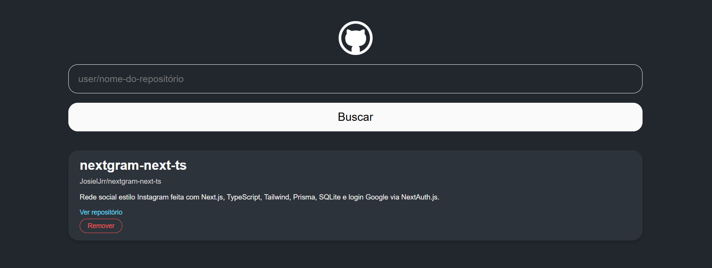

# 📦 Gerenciador de Repositórios do GitHub

Aplicação web desenvolvida em React que permite buscar, visualizar e gerenciar repositórios do GitHub.

<div align="center">
  
</div>

## ✨ Funcionalidades

- **Busca de repositórios** por nome completo (`user/repo`)
- **Adição de repositórios** à lista
- **Remoção de repositórios**
- **Redirecionamento** para o repositório no GitHub
- **Exibição de informações básicas** do repositório

## 🛠 Tecnologias

- [React](https://conf.react.dev/)
- [Styled-components](https://styled-components.com/)
- [GitHub API](https://docs.github.com/en/rest)
- [Axios](https://axios-http.com/)

## ⚙️ Instalação

Para executar este projeto localmente, siga os seguintes passos:

1. Clone o repositório:
    ```bash
    git clone https://github.com/JosielJrr/github-repository-manager.git
    cd github-repository-manager
    ```
2. Instale as dependências:
    ```bash
    npm install
    ```
3. Inicie o servidor:
    ```bash
    npm start
    ```

> Este projeto foi desenvolvido como parte da **Formação React Developer da [Digital Innovation One](https://www.dio.me/)**.
