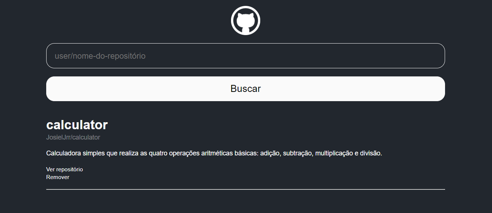

# Repository Manager

<div align="center">
  
</div>

Este projeto é uma aplicação web desenvolvida em React que permite buscar, encaminhar e gerenciar repositórios do GitHub.

## Funcionalidades

- **Busca de Repositórios**: Permite que os usuários pesquisem repositórios no GitHub.
- **Gerenciamento de Repositórios**: Adiciona e remove repositórios da lista.
- **Exibição de Repositórios**: Mostra detalhes dos repositórios com informações básicas.
- **Encaminhamento para o Repositório no GitHub**: Permite acessar o repositório remoto.

## Tecnologias Usadas

- React
- JavaScript
- HTML
- CSS
- GitHub API

## Instalação

Para executar este projeto localmente, siga os seguintes passos:

1. Clone o repositório:
    ```bash
    git clone https://github.com/JosielJrr/github-repository-manager.git
    ```
2. Navegue para o diretório do projeto:
    ```bash
    cd github-repository-manager
    ```
3. Instale as dependências:
    ```bash
    npm install
    ```
4. Inicie o servidor de desenvolvimento:
    ```bash
    npm start
    ```

## Scripts Disponíveis

No diretório do projeto, você pode executar:

- `npm start`: Inicia a aplicação em modo de desenvolvimento.
- `npm test`: Executa os testes em modo interativo.
- `npm run build`: Cria uma versão otimizada para produção da aplicação.
- `npm run eject`: Remove as dependências de configuração e permite personalizar o setup (opcional).

## Nota Adicional

 - Este projeto foi desenvolvido como parte da Formação React Developer da [Digital Innovation One](https://www.dio.me/).
